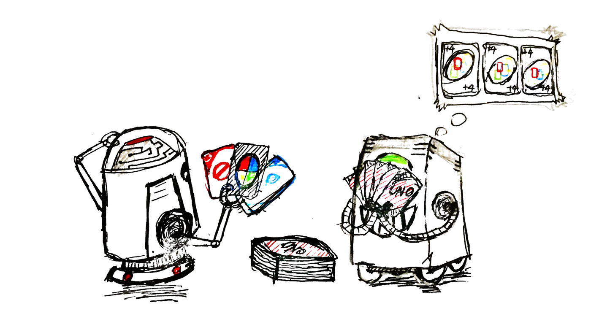

# CS181
Artificial Intelligence, UC Berkeley's CS188 taught at ShanghaiTech

## Final
[final](https://github.com/huiwy/AlphaUNO-Zero)

## Tips
- You'll be mainly operating on collections of data in the 6 projects, and most data presented to you will are lists. So make good use of high order functions like `map`, `reduce`, `sum`, as well as list comprehensions, for they are elegant and concise.
- In project 4, you'll probably need to implement a cache to speed up computation of particle filtering. Declaring a dictionary is one way, yet python already of builtin support for that, check out `lru_cache` in `functools`.
- A common pattern seen among questions is that latter agents improve upon prior agents. That is to say, you don't need to copy around code, just inherit from agents you previously implemented. Manifest the power of OOP!